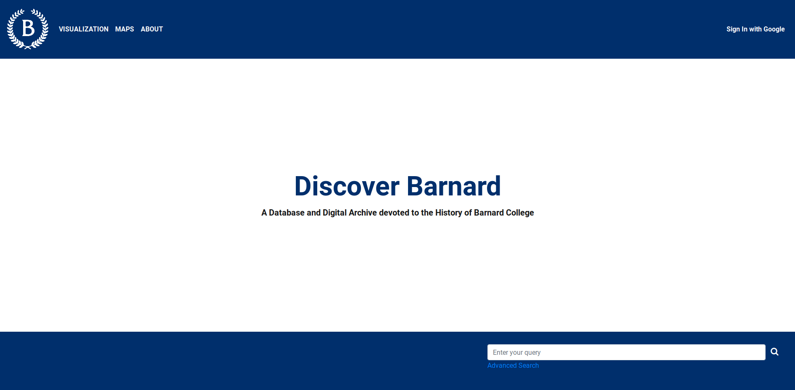
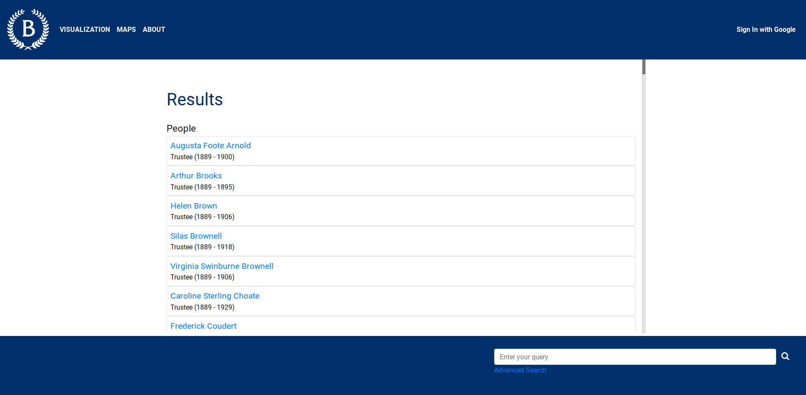
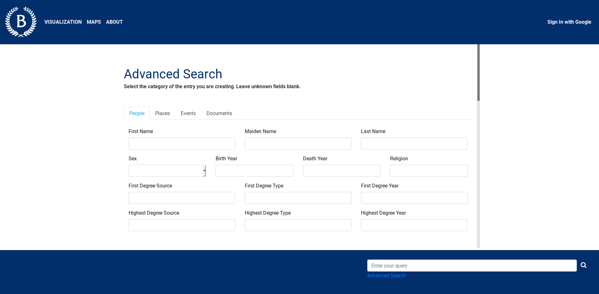
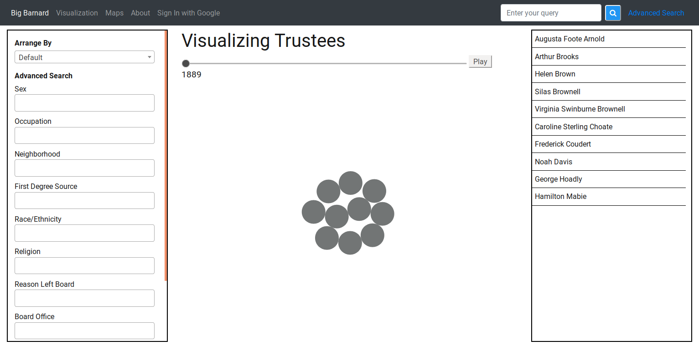

# barnard-history-public

(This is the publicly available documentation for the barnard History Data Portal, which is a closed source web application under copyright by Barnard College. The Barnard logo and branding are property of Barnard College.)

Pedal Technologies was commissioned by Barnard College to set up a database and visual data explorer devoted to the history of the institution. We collaborated with Prof. Robert McCaughey to digitize his research on the people and events in Barnard's history. The data portal is currently under development, but will eventually be available at https://barnardhistory.org/.

## Features

### Database
- Users can search a MongoDB-powered database of people, places, documents, and events beyond the 120+ year history of Barnard College

### Search
- Users can quickly search for entries by name, or use the advanced search form to run a more specified query

### Visual Explorer
- Entries from the database automatically populate the data visualization. Users can use this tool to identify patterns and trends over extended periods of time

